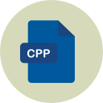

<!-- PROJECT LOGO -->
<br />
<p align="center">
  <a href="https://github.com/Aaryan-R-S/DSA-Tutorials">
    
  </a>

  <h3 align="center">Data Structures and Algorithm Tutorials</h3>

  <p align="center">
    A awesome Tutorial to kickstart your coding journey!
    <br />
    <strong>Explore the docs »</strong>
    <br />
    <br />
</p>


<!-- TABLE OF CONTENTS -->
<details open="open">
  <summary>Table of Contents</summary>
  <ol>
    <li>
      <a href="#about-the-tutorial">About The Tutorial</a>
      <ul>
        <li><a href="#technologies-used">Technologies Used</a></li>
      </ul>
    </li>
    <li>
      <a href="#getting-started">Getting Started</a>
      <ul>
        <li><a href="#pre-requisites">Pre-requisites</a></li>
        <li><a href="#installation">Installation</a></li>
      </ul>
    </li>
    <li><a href="#roadmap">Roadmap</a></li>
    <li><a href="#license">License</a></li>
    <li><a href="#acknowledgements">Acknowledgements</a></li>
  </ol>
</details>


<!-- ABOUT THE PROJECT -->
## About The Tutorial

![Product Name Screen Shot][product-screenshot]

There are many DSA Tutorials available on internet, however, I didn't find one that really suit my needs so I created this  one. I wanted to create it so amazing that it'll be containing every important topic you will ever study.

Here's why:
* You shouldn't be doing the same tasks over and over like revisiting long and boring documentations for refering the commands.
* Your time should be focused on creating something amazing. A project that solves a problem and helps others.


A list of commonly used resources that I myself followed and find helpful are listed in the acknowledgements.

### Technologies Used
* [C++](https://devdocs.io/cpp/)
* [GitHub](https://github.com)


<!-- GETTING STARTED -->
## Getting Started

To get a local copy up and running follow these simple steps.

### Pre-requisites

1. Basic understanding of C++ (Tutorials: [English ](https://youtu.be/vLnPwxZdW4Y)| [Hindi](https://www.youtube.com/playlist?list=PLu0W_9lII9agpFUAlPFe_VNSlXW5uE0YL))
2. MinGW installed on your computer (See `Installation`)
3. GitHub Account ([Sign Up](https://github.com))

### Installation

- Clone the repo
   ```sh
   git clone https://github.com/Aaryan-R-S/DSA-Tutorials.git
   ```
- Install [MinGW]((https://osdn.net/projects/mingw/releases/))
- Add MinGW bin directory to Path
  <br>
  [How?](https://stackoverflow.com/questions/5733220/how-do-i-add-the-mingw-bin-directory-to-my-system-path)

<!-- ROADMAP -->
## Roadmap

- `Tutorials` folder contains various c++ files with code on various DSA topics alongwith some problems and their solutions.
- Now, you are ready to go!


<!-- LICENSE -->
## License

Feel free to clone this repository and use/edit it according to your needs.
<br>
See `LICENSE` for more information.


<!-- ACKNOWLEDGEMENTS -->
## Acknowledgements
* [C++ Tutorials @Code With Harry](https://www.youtube.com/playlist?list=PLu0W_9lII9agpFUAlPFe_VNSlXW5uE0YL)
* [DSA @Code With Harry](https://www.youtube.com/playlist?list=PLu0W_9lII9ahIappRPN0MCAgtOu3lQjQi)
* [DSA @Jenny's Lecture](https://www.youtube.com/playlist?list=PLdo5W4Nhv31bbKJzrsKfMpo_grxuLl8LU)
* [DSA @Apna College](https://www.youtube.com/playlist?list=PLfqMhTWNBTe0b2nM6JHVCnAkhQRGiZMSJ)
* [Flaticon](https://flaticon.com)


<!-- MARKDOWN LINKS & IMAGES -->
[product-screenshot]: readme-images/screenshot.png
